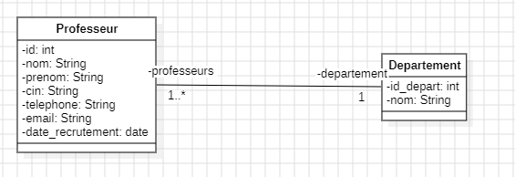
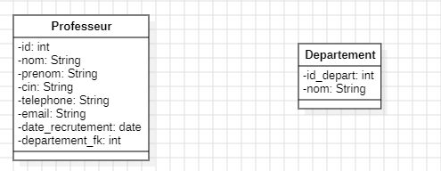

# Management of Departments and Professors

## Description
This project is a desktop application developed using **JavaFX**, designed to manage departments and professors within an organization (e.g., a university). It integrates a relational database to store information and provides an intuitive user interface to perform CRUD operations (Create, Read, Update, Delete) on departments and professors.

## Class-Diagram

## MLD


## Features
- **Department Management:**
    - Add a new department.
    - Update department information.
    - Delete a department.
    - List all departments.

- **Professor Management:**
    - Add a new professor.
    - Update professor information.
    - Delete a professor.
    - Assign a professor to a department.
    - Search professors by keywords (name, surname, CIN, etc.).

- **Interactive User Interface:**
    - Departments displayed in a `ListView`.
    - Professors displayed in a `TableView`.
    - Dynamic queries and real-time database updates.

## Technologies Used
- **Language:** Java (JDK 17+)
- **Framework:** JavaFX for the user interface.
- **Database:** MySQL (or any relational database compatible with JDBC).
- **Connection Management:** Singleton Pattern for database connection handling.
- **Recommended IDE:** IntelliJ IDEA (Premium recommended for JavaFX).

## Prerequisites
1. **Java Development Kit (JDK):**
    - Install Java 17 or higher. [Download here](https://www.oracle.com/java/technologies/javase-downloads.html).
2. **MySQL Database:**
    - Set up a MySQL database with the required tables.
3. **JavaFX SDK:**
    - Download and configure JavaFX. [Official Guide](https://openjfx.io).
4. **IntelliJ IDEA:**
    - Use IntelliJ IDEA to import and run the project.

## Database Configuration
Create a MySQL database and configure the tables as follows:

### Database Creation Script
```sql
CREATE DATABASE university_management;

USE university_management;

CREATE TABLE department (
    id INT AUTO_INCREMENT PRIMARY KEY,
    name VARCHAR(255) NOT NULL
);

CREATE TABLE professor (
    id INT AUTO_INCREMENT PRIMARY KEY,
    first_name VARCHAR(255) NOT NULL,
    last_name VARCHAR(255) NOT NULL,
    cin VARCHAR(20) UNIQUE NOT NULL,
    phone VARCHAR(15),
    email VARCHAR(255),
    recruitment_date DATE NOT NULL,
    department_id INT,
    FOREIGN KEY (department_id) REFERENCES department(id)
);
